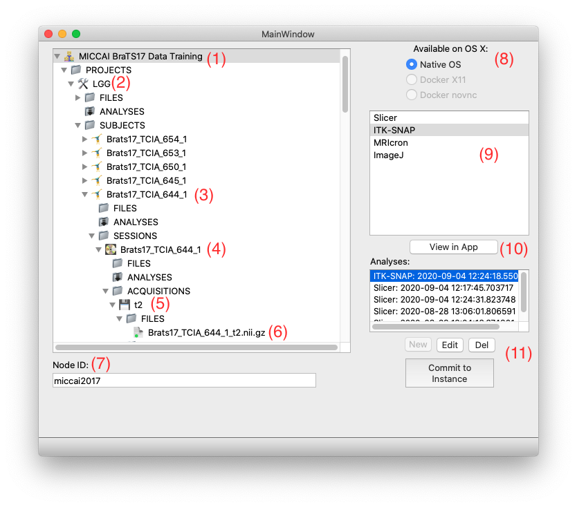

# fw-app-launcher

This project provides a cross-platform user interface to download, view, and produce application-specific workflows from selected data within a particular Flywheel instance.

This functional prototype delivers a complete set of essential--not exhaustive--features:

* A tree representation of the Flywheel Container Hierarchy
  * Individual or groups of files are selected for caching and local viewing

* An selector for applications (Apps) that are available to open on the local operating system.
  * Applications or launchable docker images containing applications must be registered with the application.

* A means to define an application-specific workflow (Analysis) and upload the results to the source Flywheel instance on completion.

Components of the following screenshot are described below:

1. Group Containers of an instance are at the root of the tree. Groups of the logged in instance are listed (e.g. `fw login`).
2. A selected group's projects. Children of a particular node are populated on the expansion of that node. Projects, Subjects, Sessions, and Acquisitions can have files and analyses.
3. A subject under the expanded project.
4. A session under the expanded subject.
5. An acquisition under the expanded session.
6. A File under a specified acquisition. A green dot on a file indicates that it is cached. A context menu, "View in App", or an "Edit" Analysis will cache the file locally.
7. Just a tool to give the `_id` of any container or file. Useful. Believe me.
8. Each application may have three different ways it can be launched on a given operating system (listed in the label). If that application is registered with the launcher (or in the expected default location), the radio button will be enabled.
9. The applications registered and available to launch. Some may not be installed or available on the given operating system. Those will be marked as disabled.
10. The "View in App" button launches the selected app with files selected in the tree on the left.
11. A group of controls that
  * Creates a new local analysis--associating the app and method of opening with itself.
  * Edits that analysis by opening application with files queued from the tree.
  * deletes a selected analysis from the list and filesystem.
  * Commits the selected analysis to the Flywheel instance and uploads the output files.
